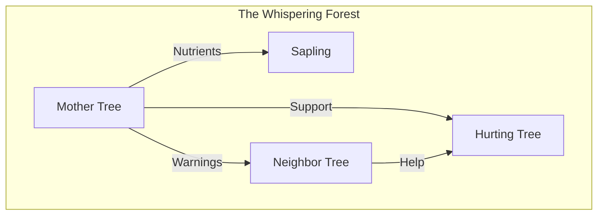
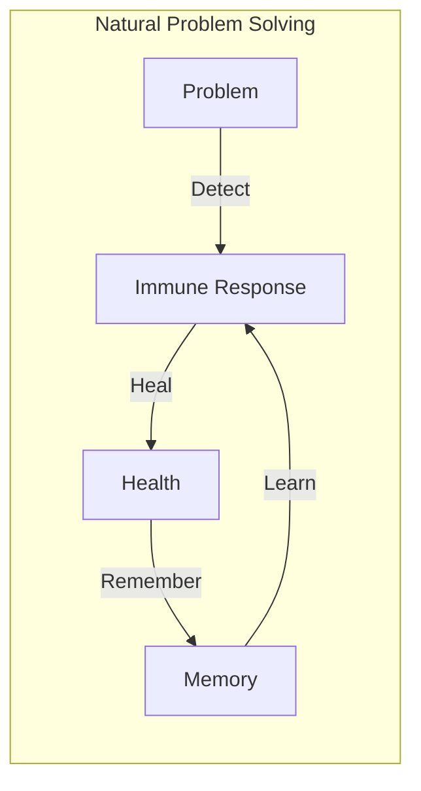
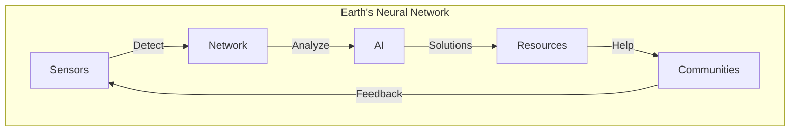
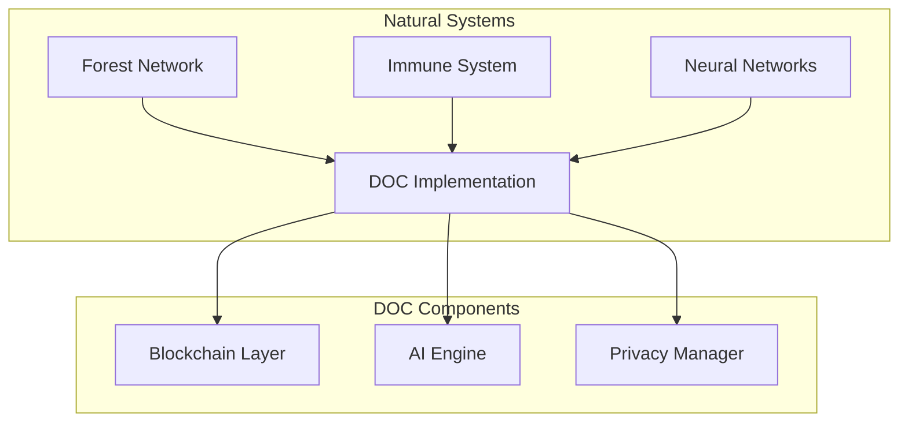

# Decentralized-Organic-Computing
# Nature's Internet: Learning from Nature to Build a Better World
[](https://www.gnu.org/licenses/gpl-3.0)

Have you ever walked through a forest and wondered how all the trees seem to know what to do? It turns out they're actually talking to each other! They use an underground network of fungi - like a natural Internet - to share food, send warnings, and help each other grow.

## The Forest's Secret Network

Imagine if you could see under the ground in a forest. You'd find something amazing: a huge web of tiny threads connecting all the trees, like a giant social network. Scientists call it the "Wood Wide Web"! Through this network:
- Big "mother" trees share food with baby trees
- Trees warn each other about dangers
- Sick trees get help from healthy ones
- The whole forest works together as one big family



## What We Can Learn From This

Now, here's the cool part: what if we could build our technology to work the same way? Instead of having big central computers controlling everything, we could have systems that work like forests:
- Sharing resources where they're needed
- Helping each other automatically
- Fixing problems naturally
- Working together without needing a boss

## Real-World Magic

Think about your body for a minute. When you get a cut, you don't have to tell your body to heal it - it just knows what to do! Your immune system is like a super-smart network that:
- Finds problems automatically
- Sends help where it's needed
- Remembers how to fight similar problems in the future
- Works 24/7 without you even thinking about it



## Making It Real

We're working on creating a similar system for our whole planet! Imagine:
- Trees, plants, and soil having tiny sensors that tell us when they need help
- Resources automatically going where they're needed most
- Problems getting fixed before they become big
- Everyone working together like cells in one big body



## Why This Matters

Just like a forest or your body, our planet is one big living system. By learning from nature, we can:
- Help heal damaged environments
- Share resources more fairly
- Solve problems more naturally
- Make sure everyone has what they need

## The Big Picture

It's like upgrading Earth to have its own nervous system:
- The forests, oceans, and air are its body
- Sensors and computers are its nerve endings
- The internet is its neural network
- All of us are like its cells, working together

## Technical Implementation

Our Decentralized Organic Computing (DOC) system implements this vision through:



### Key Features
- **True Decentralization**: Blockchain-based architecture with no central control
- **Privacy by Design**: Advanced cryptographic protocols for data sovereignty
- **Autonomous Operation**: AI-driven nodes that can self-organize and evolve
- **Natural Adaptation**: Systems that learn and adapt like biological organisms
- **Community Governance**: Decentralized decision-making for system evolution

## Getting Started

```bash
# Clone the repository
git clone https://github.com/PrashantBhaga/Decentralized-Organic-Computing.git

# Navigate to the project directory
cd Decentralized-Organic-Computing

# Install dependencies
npm install

# Run the development environment
npm run dev
```

## Documentation
- [Core Concepts](docs/core-concepts.md)
- [Technical Architecture](docs/architecture.md)
- [Getting Started](docs/getting-started.md)
- [Contributing Guidelines](CONTRIBUTING.md)
- [Development Guide](docs/development.md)

## The Future

Imagine a world where:
- Nature and technology work together
- Everyone helps each other automatically
- Problems get fixed before they get big
- The whole planet works together like one big forest

Just like trees have been sharing and caring for each other for millions of years, we can learn to do the same thing with our technology. It's not just about making better computers - it's about making a better world by learning from nature's wisdom!

Remember: Every forest starts with a single seed, and every big change starts with a simple idea. We're just planting the seeds of a better way to live together on our amazing planet! 🌱🌍

## Contributing

We welcome contributions from everyone! Please see our [Contributing Guidelines](CONTRIBUTING.md) for details on how to get involved.

## License

This project is licensed under the GNU General Public License v3.0 - see the [LICENSE](LICENSE) file for details.

## Contact

- Project Lead: Prashant Bhaga
- GitHub: [@PrashantBhaga](https://github.com/PrashantBhaga)

---
*"The best technology might not be the fanciest - it might be the one that works as naturally as a forest!"*
```
